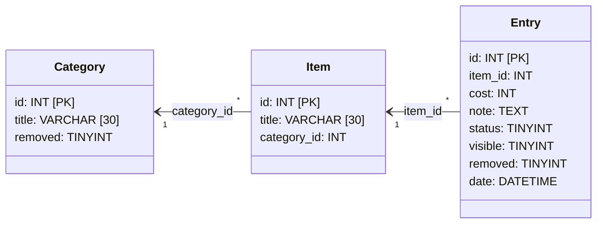

# Maintenance Tracker

Maintenance Tracker is an advanced to-do application that tracks the status of various items in a MySQL database. Values tracked include an item's category, title, status, repair cost, maintainer's note, and past updates.

The database structure is as follows:

# Initial Setup

Create your MySQL database in the format described above, and then run the program from the terminal. You can save or overwrite login credentials by passing the `-s` flag or use a one-time login by passing the `-o` flag.

**This program does not make any assumptions about the security of your setup, and the protection of credentials or credential files is the responsibility of the user.**

# Overview

After starting up the program, navigate to `localhost:{YOUR PORT}` in a web browser to view the main page. This will be accessible as long as the program is running.

At the top of the screen is the header, which displays the program logo, title, and version number along with two buttons labeled "Add" and "Save Changes." Clicking the program title will reload the main page, the Add button will open a dialogue for creating new items and categories, and the Save Changes button will save all updated fields en mass.

On the left side of the screen, there are a Table of Contents, a widget for filtering items, and a button to quickly jump to the top of the page. You can filter items by their current status (green or OK, yellow or Warning,  red or Stopped, and Show All).

The largest section of the screen is where items are listed. Items have a title, status, repair cost, maintainer's note, and a set of other options which are accessed by clicking the "Options" link.

Clicking the status indicator dot (the circle next to each item's title) will cycle through green, yellow, and red, which will the status for that item. Repair cost can be entered in the next input field. The repair cost field only accepts numerical input and a decimal point, but shortcuts such as `ctrl+a` still work. Be aware that copy/pasting invalid values into this field will reset its value to `0.00`. The note field is expandable and supports multiline text, up to around 65k characters.

The Options link, when clicked, will display other links including History, Hide, and a dropdown menu for changing an item's category. Hiding and changing the category of an item will refresh the page, so make sure to save any existing changes before doing so. When you have unsaved changes, an indicator will appear beneath the Save Changes button.

# Adding Items and Categories
To add a new category (*ex. "Vehicles"*), click `Add` > `New Category`, enter the category title, and click the "Add" button. To add an item, you must also choose a category to occupy that item (*ex. "Car" goes in the "Vehicle" category*).

# Hiding & Removing Items and Categories
To hide an item from the main viewport, click `Options` > `Hide`. This will refresh the page and, if this is the first item you've hidden, cause a section entitled "Hidden Items" to appear at the top of the page. This section is locked to the top of the page and must be scrolled into view.

Only once you have hidden an item can you "remove" it from the program. Items that are removed are *not* deleted from the database. Rather, they are not displayed anywhere on the page, including the Hidden Items section.

Restoring an item that has been removed requires access to the database itself and is not recommended unless **absolutely necessary**.

